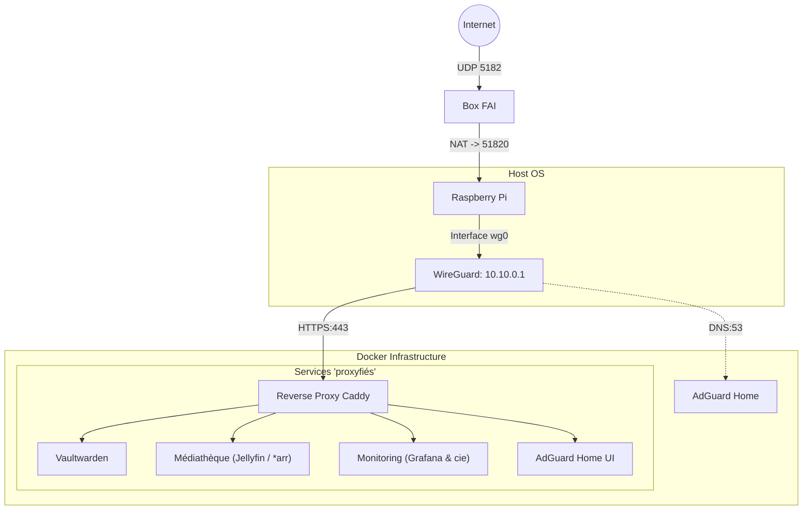

# 🏠 Homelab RPi 5 — Production Ready

Architecture de self-hosting axée sur la sécurité ("VPN-first" + accès LAN), l'observabilité et l'intégrité des données. Tout est contenairisé, sauf Wireguard.

## 🎯 Objectifs & Philosophie

- **Sécurité par Design** : Aucun port ouvert sur Internet sauf WireGuard (UDP/5182).
- **Accès Unifié** : Tous les services sont accessibles via HTTPS (`*.home`) derrière un reverse proxy, uniquement via le tunnel VPN.
- **Isolation** : Séparation des stacks (Réseaux Docker distincts) et isolation du trafic Torrent via Gluetun.
- **Résilience** : Stratégie de backup en mode PULL (le serveur ne peut pas écraser ses propres backups).

## Sommaire

- [Networking & VPN](./docs/networking-wg.md)
- [Monitoring & Observabilité](./docs/monitoring.md)
- [Stratégie de backup](./docs/backup-strategy.md)
- [Médiathèque](./docs/mediatheque.md)
- [DNS & AdGuard](./docs/adguard.md)

## 🏗 Architecture Technique

### 🌐 Réseau & Flux

- **Ingress** : L'accès distant se fait exclusivement via WireGuard.
- **DNS Local** : AdGuard Home (`10.10.0.1`) résout `*.home` vers l'IP interne du tunnel et filtre les trackers.
- **Egress Media** : Le trafic de téléchargement (qBittorrent) est encapsulé dans un tunnel VPN commercial via Gluetun.

## 🚀 Catalogue de Services

Tous les services nécessitent une connexion active au VPN WireGuard (ou réseau local à défaut, pratique quand on casse son tunnel wireguard).

| Catégorie    | Service         | URL Interne                | Rôle                                          |
|--------------|-----------------|----------------------------|-----------------------------------------------|
| **Sécurité** | **Vaultwarden** | `https://vaultwarden.home` | Coffre-fort de mots de passe.                 |
| **Media**    | **Jellyfin**    | `https://jellyfin.home`    | Serveur de streaming.                         |
|              | **qBittorrent** | `https://qbit.home`        | Client Torrent (trafic sécurisé via Gluetun). |
|              | **Sonarr**      | `https://sonarr.home`      | Gestionnaire de séries TV.                    |
|              | **Radarr**      | `https://radarr.home`      | Gestionnaire de films.                        |
|              | **Prowlarr**    | `https://prowlarr.home`    | Gestionnaire d'indexeurs.                     |
| **Ops**      | **Grafana**     | `https://grafana.home`     | Dashboards de supervision.                    |
|              | **Prometheus**  | `https://prometheus.home`  | Métriques brutes.                             |
|              | **Promtail**    | `https://promtail.home`    | Labels pour logs.                             |
|              | **AdGuard**     | `https://adguard.home`     | Interface admin DNS & Filtrage.               |

> note: bien sur, les torrents téléchargés sont légaux, je possède les droits, et le VPN est utilisé pour éviter les throttling de la part du FAI et protéger ma vie privée contre les trackers intégrés. j'suis un bon netizen, vive hadopi, vive l'arcom ! 🤙🏻
