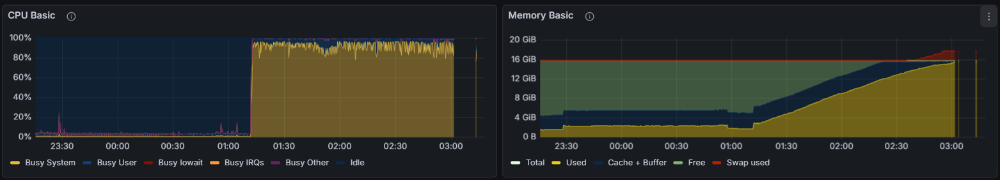
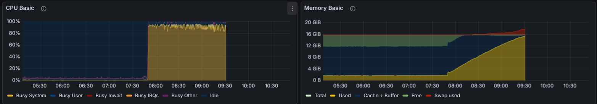

# Homelab Changelog

## [11-02-2026] - Phase 1 Clôturée : Data Safety & Resilience

- Script de snapshot sur la Pi (`backup_vaultwarden.sh`) avec backup à chaud de SQLite.
- Script de pull sur Mac (`pull_backup.sh`) avec gestion des fallbacks SSH (VPN/Eth/Wlan).
- Procédure de recovery complète sur Mac via Docker Colima.
- Rétention par occurrences : 3 sur la Pi, 10 sur le Mac.

---

## [12-02-2026] - Phase 2 Clôturée : Core Services & Networking

- DNS en place via Adguard.
    - Wildcard *.home pour rewriting DNS.
- Healtchecks sur 100% des containers.
- HTTPS partout, CA locale OK.
- Corrections :
    - Passage en mode PULL à partir du mac pour plus de sécurité et de flexibilité. Suppression de la clé SSH Pi -> Mac (anciennement `id_ed25519_backup_service`)
    - Alignement des logs au format ISO 8601 pour future ingestion Loki.

---

## [13-02-2026] - Phase 3 Clôturée : Monitoring

- Reste à faire les healtchecks pour certaines images, `curl` et `wget` pas présent (img distroless ?). J'ai pas cherché beaucoup plus loin, mais peut être avec `/dev/tcp` plus tard.
- Finir de bien gérer les logs. `qbittorrent` et d'autres containers ne sont pas forcément visibles pour `Loki` et `Promtail` ce qui est un peu pénible !

---

## [19-02-2026] - Phase 4 Clôturée : IaC, SRE & Cold Backup

- Migration vers Ansible pour la gestion des permissions et le déploiement.
- Un test effectué sur la Pi pour vérifier que les données stateful sont bien préservées après un cycle `down -> tar -> up` du stack et qu'un redéploiement via Ansible ne cause pas de corruption.
- Uniformisation de Caddy (utilisait les volumes docker pour les configs) : maintenant tout est dans `/srv/services/caddy/{data,config}`
- Implémentation du "Cold Backup" : script `backup.sh` avec cycle `down -> tar -> up`.
- Résolution définitive des corruptions Loki/Prometheus via arrêt complet des stacks.
    - `stop` et `start` ne sont pas suffisant pour Loki/Prometheus qui gardent des fichiers ouverts, d'où l'arrêt complet des stacks.
- Standardisation des permissions : boucle Ansible pour les UIDs spécifiques (Loki, Grafana, Prometheus).
- Ajout de `stack.sh` : Outil CLI pour la gestion globale des services.

---

## [23-02-2026] - Phase 5 Clôturée : SRE Security & Hardening

- **Audit de sécurité :** Mise en place d'un scan de vulnérabilités automatisé avec Trivy.
- **Hardening SSH :**
    - Auth par clé (c'était déjà le cas)
    - Restriction de l'écoute `sshd` aux interfaces internes (LAN et VPN WireGuard) au lieu de `0.0.0.0` pour couper tout mouvement latéral depuis un conteneur compromis.

- **Hardening Docker (Le standard SRE appliqué) :**
1. **Read-Only OS (`read_only: true`) :** Verrouillage de l'OS interne des conteneurs pour empêcher l'installation d'outils ou la persistance de malwares.
2. **Temporary Files in RAM (`tmpfs`) :** `/tmp`, `/run` et `/var/run`, purgés à chaque redémarrage.
3. **Privilege Escalation Lock (`no-new-privileges:true`) :** Interdiction d'utiliser `sudo` ou un bit `suid`.
4. **Principle of Least Privilege (`cap_drop: ALL`) :** Retrait de toutes les permissions d'administration système (capabilities) du noyau Linux.
5. **Surgical Capabilities (`cap_add`) :** Restitution stricte et documentée des droits vitaux (ex: `NET_BIND_SERVICE`, `NET_ADMIN`).
6. **Gestion s6-overlay (LinuxServer) :** Autorisation des capacités `CHOWN`, `SETUID`, `SETGID` et de l'option `exec` sur les `tmpfs` pour permettre le drop de privilèges (`PUID`/`PGID`) au démarrage.
7. **Subfolder Permissions (Cas Gluetun) :** Déclaration de `tmpfs` spécifiques avec des droits ouverts (`mode=1777`) lorsque des sous-processus non-privilégiés doivent écrire dans des dossiers créés par root. (ip fetcher de Gluetun qui perd ses droits après création d'un sous-dossier).

## [24-02-2026] - Maintenance

- Mise en place de limites de ressources suite à 2 crashs (emballement).

Toujours pareil, ça s'emballait sur un service (Grafana qui devient le problème qu'il surveille 😂​) on voit bien que le CPU bloque d'un coup, la pression sur la RAM monte petit à petit, même la swap et pouf, OOM 💀

- Maintenance de l'écoute SSH sur 0.0.0.0 car sshd s'avère capricieux sur d'autres configurations. (L'interface wg0 est up après le lancement de sshd, d'où l'impossibilité de bind dessus directement). Si une interface est down au lancement de sshd, alors il se coupe totalement et ne redémarre pas... j'ai du sortir le clavier et la souris 😅​ (non `net.ipv4.ip_nonlocal_bind = 1` ne suffit pas, il faudra investiguer plus en détail), de toutes façons `ufw` veille au grain 