# 📘 Infrastructure DNS & Résolution Locale

## 👀 Vue d'ensemble

L'infrastructure s'appuie sur **AdGuard Home** fonctionnant dans un conteneur Docker. Il remplit deux rôles critiques :

- **Filtrage DNS** : Blocage des publicités, trackers et domaines malveillants au niveau du réseau.
- **Autorité de Nommage Interne** : Résolution des domaines personnalisés en `.home` sans dépendre de modifications locales tq `/etc/hosts` ou équivalent sur Windows.

```mermaid
graph TD
    subgraph "Client (Remote Device)"
        C[Client : 10.10.0.x]
    end

    subgraph "Raspberry Pi (10.10.0.1)"
        AGH{AdGuard Home}
        Caddy[Caddy Proxy]
    end

    subgraph "Internet (Upstreams)"
        DoH[DNS-over-HTTPS / DoT]
        Q9[Quad9 / Cloudflare]
    end

    %% Flux DNS
    C -->|Requête DNS : port 53| AGH
    
    %% Logique de décision
    AGH -->|Domaine *.home| Local[DNS Rewrite: 10.10.0.1]
    AGH -->|Domaine Externe| DoH
    
    DoH --> Q9
    Q9 -->|Réponse chiffrée| AGH

    %% Flux HTTP suite au DNS
    Local -->|Résolution OK| Caddy
    Caddy -.->|Route vers| Services[Services Docker]
```

## 🔄 Flux de Résolution DNS

Le flux suit une logique de tunnelisation sécurisée pour garantir la confidentialité des requêtes :

1. **Client (Mac/Windows)** : Envoie une requête DNS via l'interface virtuelle **WireGuard** (`10.10.0.x`).
2. **Serveur DNS (Pi)** : AdGuard Home écoute sur `10.10.0.1:53`.
3. **Traitement Local** : Si le domaine correspond à `*.home`, AdGuard renvoie immédiatement l'IP `10.10.0.1`.
4. **Traitement Externe** : Si le domaine est externe (ex: `google.com`), AdGuard transmet la requête via des protocoles chiffrés (**DNS-over-HTTPS**) vers les serveurs amont (**Quad9** ou **Cloudflare**).

## 🔒 Configuration des Upstreams (Sécurité)

Pour prévenir l'écoute (eavesdropping) par le fournisseur d'accès ou des tiers, le chiffrement est activé par défaut :

- `https://dns.quad9.net/dns-query` (Filtrage malware inclus)
- `https://1.1.1.1/dns-query` (Rapidité & redondance)
- `tls://dns.quad9.net` (Backup via DNS-over-TLS)

## 🔄 Réécritures DNS (DNS Rewrites)

Une règle globale de type "Wildcard" a été mise en place pour simplifier l'ajout de nouveaux services :

- **Règle** : `*.home` → `10.10.0.1`
- **Impact** : Tout service ajouté dans le `Caddyfile` de la Raspberry Pi avec une extension `.home` sera automatiquement résolu par les clients du VPN sans configuration supplémentaire.