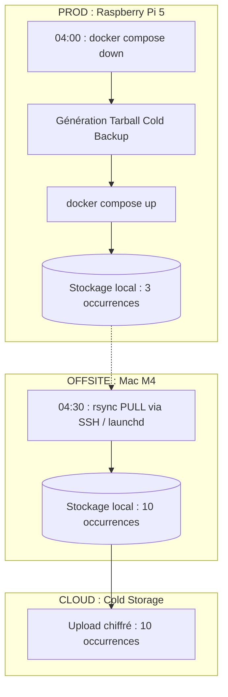
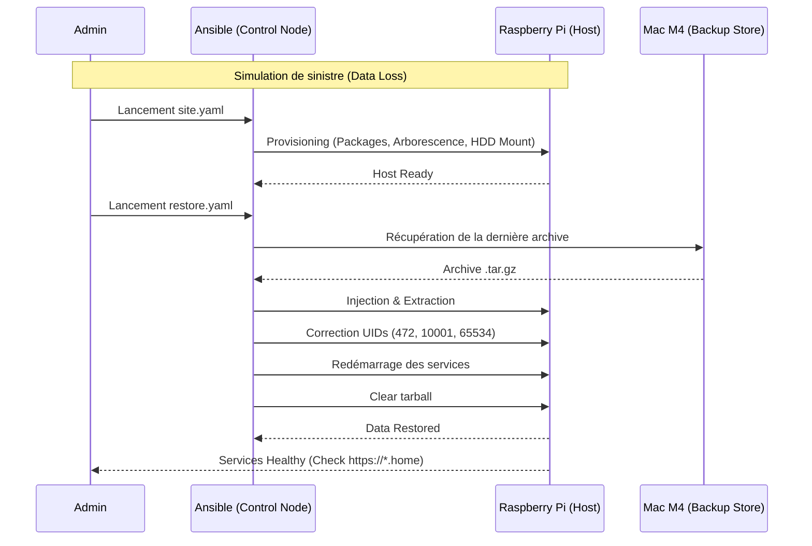

# 🛡️ Stratégie de Sauvegarde Globale

Les containers sont éphémères, mais les données ne le sont pas. La stratégie de sauvegarde est conçue pour garantir la résilience et la récupération rapide en cas de sinistre, tout en minimisant les risques de perte de données.

L'ensemble des services montent un volume Docker pointant vers `/srv/services/<service_name>/data` ou `srv/services/<service_name>/appdata/<container>` si nécessaire (plusieurs containers dans le service). C'est dans ces dossiers que sont stockées les données stateful (bases de données, configurations, etc.) qui sont à sauvegarder pour ne pas perdre l'état.

## 🧊 Snapshot local (cold cold backup)

Le script `/srv/scripts/backup.sh` s'exécute chaque nuit à 04h00 via un cronjob root.

- **Méthode** : Arrêt complet des services (`docker compose down`)
- **Périmètre** : `/srv/services`, `/etc/wireguard`, `/etc/ssh`.
- **Intégrité** : Utilisation de `--absolute-names` pour une restauration sans erreur.

> **IMPORTANT**
> Idéalement, je souhaitais faire un `docker stop` -> `archivage` -> `docker start` pour éviter le reset des networks docker etc. Malheureusement, j'ai rencontré des problèmes d'intégrité des données (base de données corrompue) avec cette méthode pour Loki et Prometheus. Le backup est donc légèrement plus long (quelques secondes) mais **fiable**.

## 💾 Archivage offsite

Le Mac pull les archives via SSH/Rsync à 04h30 (ou à la première connexion si le Mac est éteint à ce moment-là) avec `launchd`. Initialement j'avais fait un cronjob sur le mac mais si il est éteint au moment du backup, c'est mort. 😁

- **Rétention** : 3 occurrences sur la Pi, 10 sur le Mac, 10 dans le cloud.

## 🛠️ Procédure de Restauration

Décompression de l'archive via le playbook Ansible `restore.yaml`.

## 🧪 Tests de restauration

- **Test de restauration effectué** : 

- Restauration complète testée avec succès.
- Procédure :
    1. Arrêt des services (`docker compose down`).
    2. On casse volontairement des trucs (ex: suppression d'un dossier de config, ou d'une base de données, modification sauvage de fichiers stateful).
    3. Exécution du playbook Ansible `site.yaml` pour restaurer l'état initial basique, c'est à dire :
        - packages essentiels (Docker, WireGuard, vim, etc.)
        - Arborescence de `/srv` avec les bonnes permissions.
        - Check présence du HDD
    4. Exécution du playbook Ansible `restore.yaml` pour restaurer les données à partir de la dernière archive.
    5. Vérification que tout est revenu à la normale (services qui sont redémarrés, données présentes, modifications sauvages non présentes dans l'archive plus présente)