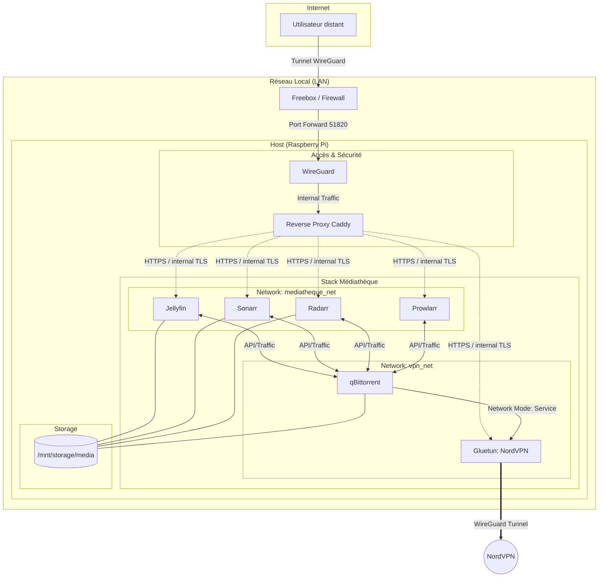

# 📄 Stack Médiathèque — Architecture & Exploitation

## 🎯 Objectif

Plateforme d'automatisation et de streaming média sécurisée sur Raspberry Pi.

- **Téléchargement :** qBittorrent isolé via tunnel VPN (NordVPN/WireGuard).
- **Automatisation :** Suite "Arr" (Prowlarr, Radarr, Sonarr).
- **Streaming :** Jellyfin.
- **Sécurité :** Accès exclusif via **WireGuard** (aucun port web exposé sur la box) et Reverse Proxy interne via **Caddy**.

---

## 🌐 Architecture Réseau (Accès Privé)



## 🛠️ Services & Ports

| Service         | Image                     | Rôle                     | Réseau                        | Port (Interne) |
|-----------------|---------------------------|--------------------------|-------------------------------|----------------|
| **Gluetun**     | `qmcgaw/gluetun`          | Client VPN NordVPN       | proxy_caddy / mediatheque_net | -              |
| **qBittorrent** | `linuxserver/qbittorrent` | Client Torrent           | **container:gluetun**         | 8080           |
| **Prowlarr**    | `linuxserver/prowlarr`    | Gestionnaire d'indexeurs | proxy_caddy / mediatheque_net | 9696           |
| **Sonarr**      | `linuxserver/sonarr`      | Gestion des Séries       | proxy_caddy / mediatheque_net | 8989           |
| **Radarr**      | `linuxserver/radarr`      | Gestion des Films        | proxy_caddy / mediatheque_net | 7878           |
| **Jellyfin**    | `linuxserver/jellyfin`    | Serveur de Streaming     | proxy_caddy / mediatheque_net | 8096           |

## 💾 Gestion du Stockage

- **Volume Docker :** `/srv/services/mediatheque/appdata` pour les données applicatives.
- **Mount data :** `/mnt/storage/media` pour les médias (films, séries, téléchargements).

### 📂 Arborescence

```
/mnt/storage/media/
├── downloads/          # Fichiers temporaires (Arr services)
├── movies/             # Bibliothèque de films
└── tv/                 # Bibliothèque de séries

/srv/services/mediatheque/appdata/
├── gluetun/
├── jellyfin/
├── prowlarr/
├── qbittorrent/
├── radarr/
└── sonarr/
```

### 🔒 Permissions

Utilisation stricte de **PUID=1001 / PGID=1001** pour éviter les conflits de droits entre Docker et l'hôte.

## VPN/OpSec (Hadopi xD 🚔)

L'isolation est assurée par le `network_mode: "service:gluetun"` de qBittorrent.

> **IMPORTANT**
> Si le conteneur Gluetun s'arrête ou perd la connexion, qBittorrent perd instantanément tout accès réseau (Kill Switch matériel par design Docker).

## 🚀 Installation Rapide

### 🔑 Configuration Secrets

Créer le fichier `/srv/services/mediatheque/.env` :

```bash
NORDVPN_WG_PRIVATEKEY="your_private_key"
NORDVPN_WG_ADDRESS="10.5.x.x/32"
```

## 🧪 Vérifications Post-Installation

Exécuter cette commande pour confirmer que qBittorrent sort bien via NordVPN :

```bash
docker exec gluetun wget -qO- https://ipinfo.io/ip
```

### 🛣️ Routes WebUIs

| Service         | URL                     |
|-----------------|-------------------------|
| **Jellyfin**    | `https://jellyfin.home` |
| **qBittorrent** | `https://qbit.home`     |
| **Radarr**      | `https://radarr.home`   |
| **Sonarr**      | `https://sonarr.home`   |
