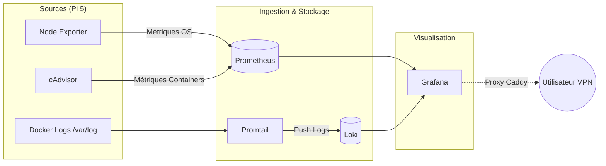

# 📊 Stack Monitoring — Observabilité & Centralisation

## 🎯 Objectif

- **Infrastructure (Hardware) :** Métriques CPU, RAM, Température, I/O via **Node Exporter**.
- **Containers (Runtime) :** Métriques de performance par service via **cAdvisor**.
- **Logs (Exploration) :** Centralisation et indexation des logs via **Loki** & **Promtail**.
- **Visualisation :** Dashboards unifiés sous **Grafana**.

## 🌐 Architecture des Flux



## 🛠️ Services & Endpoints

| Service           | Rôle               | Port Interne | Port Externe | URL Interne               |
|-------------------|--------------------|--------------|--------------|---------------------------|
| **Grafana**       | Visualisation      | `3000`       | `3002`       | `https://grafana.home`    |
| **Prometheus**    | Stockage Métriques | `9090`       | `9090`       | `https://prometheus.home` |
| **Loki**          | Stockage Logs      | `3100`       | `3100`       | -                         |
| **cAdvisor**      | Métriques Docker   | `8080`       | `8081`       | -                         |
| **Node Exporter** | Métriques OS       | `9100`       | -            | -                         |
| **Promtail**      | Collecteur de logs | `9080`       | -            | -                         |

## 🛠️ Choix Techniques & Optimisations

### Préservation du SSD (Rétention)

Parce que l'espace n'est pas infini, une politique de rétention stricte est appliquée :

* **Prometheus :** Conservé 15 jours (`--storage.tsdb.retention.time=15d`).
* **Loki :** Suppression automatique des logs après 15 jours (`retention_period: 360h`).

### 🏷️ Le label "service_name" (logs Gluetun)

Le défi : Les conteneurs comme `qbittorrent` utilisent le réseau de `gluetun`, ce qui rend leur identification par IP ou nom de conteneur complexe pour Promtail. Pour résoudre ce problème, une convention de **Docker Labels** est utilisée pour taguer les logs à la source. C'est également une bonne pratique pour éviter les configurations complexes basées sur les IPs dynamiques des conteneurs. Je l'ai donc mis en place partout, même quand pas nécessaire, pour uniformiser la stack et faciliter les évolutions futures (alerting).

- **Solution :** Utilisation des **Docker Labels**.
- **Mise en œuvre :** Tout conteneur avec le label `logging=promtail` est aspiré, et le label `service_name` devient le tag principal dans Loki.

> **Exemple de filtre Grafana/Loki :** `{service="vaultwarden"}` pour n'afficher que les logs de Vaultwarden.

---

## 📂 Arborescence & Persistence

```text
/srv/services/monitoring/
├── docker-compose.yaml
├── config/
│   ├── prometheus.yaml  # Scrape configs (NE, cAdvisor)
│   ├── loki.yaml        # Retention & Storage settings
│   └── promtail.yaml    # Relabeling rules (Docker labels)
└── appdata/             # Données persistantes (Bases de données)
```

## 📝 Guide d'Exploitation

1. **Node Exporter Full (ID: 1860) :** RAM, CPU, Température, I/O pour diagnostiquer les problèmes de performance ou de surchauffe du hardware.
2. **cAdvisor (ID: 14282) :** Métriques détaillées par conteneur (CPU, RAM, Network) pour identifier les services gourmands ou en anomalie.
3. **Logs Explorer :** Dashboard custom avec un panel "Logs" pointant vers Loki.

### 👩🏼‍⚕️ Diagnostic de la stack

- **Vérifier les cibles Prometheus :** `https://prometheus.home/targets`
- **Vérifier les logs aspirés :** `docker logs promtail`
- **Permissions (UIDs) :** 

| Service    | UID     | Chemin                                        |
|------------|---------|-----------------------------------------------|
| Grafana    | `472`   | `/srv/services/monitoring/appdata/grafana`    |
| Loki       | `10001` | `/srv/services/monitoring/appdata/loki`       |
| Prometheus | `65534` | `/srv/services/monitoring/appdata/prometheus` |

#### Healthchecks

- Loki : Distroless. Si le service tombe, il redémarrera tout seul ! Impossible de faire un healthcheck sans binaire externe ou probe comme dans kubernetes.

```
$ docker exec -it loki /bin/sh
OCI runtime exec failed: exec failed: unable to start container process: exec: "/bin/sh": stat /bin/sh: no such file or directory
```

- Promtail : m'a donné du fil à retordre, j'ai essayé plusieurs approches sans succès :
    - `wget --spider -q http://localhost:9080/<whatever> || exit 1`
    - `cat < /dev/null > /dev/tcp/localhost/9080 || exit 1`
    - `nc -z localhost 9080`

J'ai trouvé une solution [ici (merci bulch !)](https://github.com/grafana/loki/issues/11590#issuecomment-2333481326) qui consiste à faire `printf "GET / HTTP/1.1\n\n" > /dev/tcp/localhost/9080`.